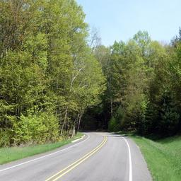
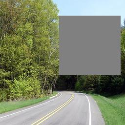
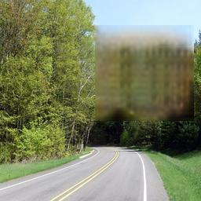
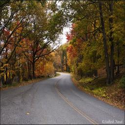
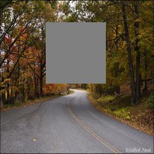
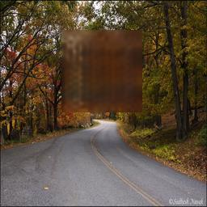

# Generative Inpainting for CS 7643 - Deep Learning Class

A PyTorch reimplementation for the paper [Generative Image Inpainting with Contextual Attention](https://arxiv.org/abs/1801.07892) according to the author's [TensorFlow implementation](https://github.com/JiahuiYu/generative_inpainting).

Final report on methodology and experiments is available [here](https://manoj98.github.io/generative-inpainting/CS_7643_DL_Project_FinalReport___Generative_Inpainting.pdf).

## Prerequisites
This code has been tested on Ubuntu 14.04 and the following are the main components that need to be installed:
- Python3
- PyTorch 1.0+
- torchvision 0.2.0+
- tensorboardX
- pyyaml

## Train the model
```bash
python train.py --config configs/config.yaml
```

The checkpoints and logs will be saved to `checkpoints`。

## Test with the trained model
By default, it will load the latest saved model in the checkpoints. You can also use `--iter` to choose the saved models by iteration.

Trained PyTorch model: [[Google Drive](https://drive.google.com/open?id=1qbfA5BP9yzdTFFmiOTvYARUYgW1zwBBK)] [[Baidu Wangpan](https://pan.baidu.com/s/17HzpiqMPLIznvCWBfpNVGw)]

```bash
python test_single.py \
	--image examples/imagenet/imagenet_patches_ILSVRC2012_val_00008210_input.png \
	--mask examples/center_mask_256.png \
	--output examples/output.png
```

## Test with the converted TF model:
Converted TF model: [[Google Drive](https://drive.google.com/file/d/1vz2Qp12_iwOiuvLWspLHrC1UIuhSLojx/view?usp=sharing)]

```bash
python test_tf_model.py \
	--image examples/imagenet/imagenet_patches_ILSVRC2012_val_00008210_input.png \
	--mask examples/center_mask_256.png \
	--output examples/output.png \
	--model-path torch_model.p
```

## Test results on ImageNet validation set patches

With PyTorch, the model was trained on Places205 for 7500 iterations (with batch_size 16, about 7h). Here are some test results on the patches from Places 205 validations set

<!-- | Input | Inpainted |
|:---:|:---:|
| [](examples/imagenet/imagenet_patches_ILSVRC2012_val_00000827_input.png)  | [](examples/imagenet/imagenet_patches_ILSVRC2012_val_00000827_output.png) |
| [](examples/imagenet/imagenet_patches_ILSVRC2012_val_00008210_input.png)  | [](examples/imagenet/imagenet_patches_ILSVRC2012_val_00008210_output.png) | -->

| Input | Masked | Inpainted |
|:---:|:---:|:---:|
| [](examples/places/images/image0.jpg)  | [](examples/places/masks/image0.jpg) | [](examples/places/images/image0.jpg) |


| [](examples/places/images/image1.jpg)  | [](examples/places/masks/image1.jpg) | [](examples/places/images/image1.jpg) |
